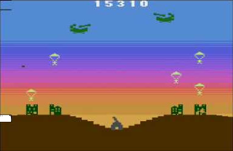

# Projeto Commando Raid
### FPRO/MIEIC, 2019/20
### Mário Ferreira (up201907727@fe.up.pt)
### 1MIEIC04

#### Objetivo

Criar um clone do clássico Command Raid em Pygame.

#### Descrição

É um jogo de ação em que o objetivo do jogo é disparar um canhão para destruir helicópteros e aviões antes que estes deixem cair bombas ou soldados que também podem ser destruidos e que danificam o canhão.

#### UI

### Pacotes

- Pygame

#### Tarefas

1. ~**BACKGROUND**~
   1. ~montanhas: duas elipses~
   1. ~céu: ciclo~
1. ~**JOGADOR**~
   1. desenhar naquela posição
   1. variar o ângulo: angle
   1. tecla -> muda o angle
1. ~**TIROS**~
   1. lista: (x, y, angulo)
      * quando carregas no space, acrescentas tuplo
      * desenhar os tiros na posição (x,y) com o angulo dado
   1. atualizar posição do tiro na lista
1. **INIMIGOS NAVES**
   ~1. de vez em quando, aparece uma nave: lista (pos_x, pos_y, orientacao)~
   ~1. atualizar posição da nave~
   1. colisão tiro/nave
1. **INIMIGOS PARAQUEDISTAS**
   ~1. nave aleatoriamente cria paraquedista em certos X: lista (pos_x, pos_y)~
   ~1. atualizar posiçáo paraquedista~
   ~1. desaparece quando ao solo~
1. **CASAS**
   ~1. Quatro cidades: (pos_x, estado)~
      * estado inicialmente = 5
   ~1. desenhar cidade conforme estado~
   1. paraquedista, reduz estado em 1
1. **TUNEL**, **PONTOS**, **MENU**

### 19/11/2019
